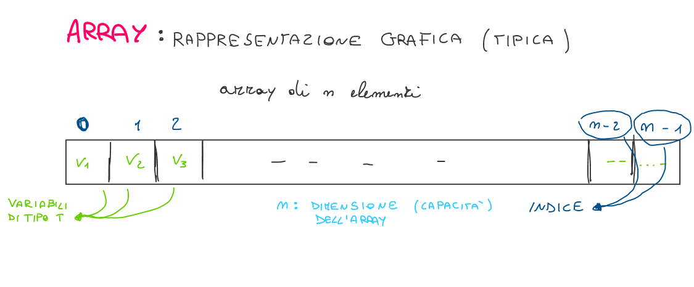
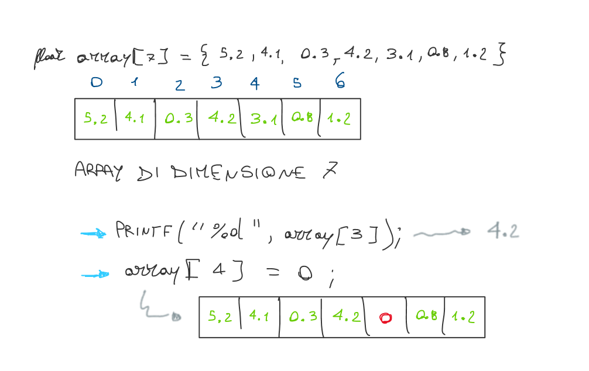

## 1. Descrizione

Un **array monodimensionale** (o vettore) è una sequenza di variabili dello stesso tipo che vengono situate consecutivamente nella memoria ed alle quali è possibile accedere usando uno stesso nome (identificatore) a cui viene aggiunto un indice. Pensiamo all'**array** come ad un insieme di cassetti numerati.

**Definizione**: **Sequenza** di $n$ elementi ($n ≥ 0$) tutti di tipo $t$ individuati singolarmente da un numero intero int fra 0 e $n-1$ (detto indice).



## 2. Dichiarazione

$$
t \ \  A[n];
$$

dove:

- $A$ → identificatore (nome);
- $t$ → tipo;
- $n$ → costante intera, dimensione;

```c
#define N 10
const int M = 100

//dichiara ad esempio un array di 10 elementi
int A[N];

//dichiara un array di 10 elementi float
float V[10];

//dichiara un array di 100 elementi
int B[M];

//array di interi con la dimensione definita implicitamente
int C = {3,5,6,2,1}

//array di interi parzialmente inizializzato
int D[10] = {3,5,6,2,1}

//array di interi totalmente inizializzato
int E[10] = {3,5,6,2,1,8,4,7,9,0}

//si può anche indicare {} inizializza gli elementi dell'array a zero
int F[N] = {0};
```

## 3. Dimensione Array

1. Numero elementi predefinito → **array statici** = dimensione array costante (nota a compile-time)
2. Numero elementi specificato a run-time → **array semidinamici** = dimensione array qualsiasi (intera)
3. Numero elementi non specificato → **array dinamici**

<Aside variant="info">
Per gli array statici e semidinamici, una volta allocata, la dimensione dell'array non è più modificabile.
</Aside>

## 4. Operazioni

### Accesso elemento

```c
int vett[5] = {2, 0, 1, 6, 3};
vett[4];  // -> mi riferisco al valore 3
```

### Lettura elemento

```c
int vett[5];
scanf("%d", &vett[2]); // inserisco un valore nella posizione 3
```

### Scrittura elemento

```c
int vett[5] = {2, 0, 1, 6, 3};
printf("%d", vett[2]); //Output: 1
```



### Cosa NON si può fare

- NO confronto e assegnamento

    ```c
    int A[10];
    int B[10];

    A == B; // ----> ERRORE
    A = B;  // ----> ERRORE
    ```

- NO I/O su array

    ```c
    int A[10];

    printf("%d", A); // ----> ERRORE
    scanf("%d", &A);  // ----> ERRORE
    ```

### Soluzione a questi problemi

per eseguire correttamente operazioni di confronto, assegnamento ed I/O è spesso necessario utilizzare dei **cicli**.

- Confronto e assegnamento:

    *esempio*: `A[i] == B[j]`

    *esempio*: `A[i] = 5`

- I/O su array:

    *esempio*:  `scanf("%d", &A[3])`

    *esempio*:  `printf("%d", A[i])`

## 5. Algoritmi principali

### Stampa Array

```c
int vett[5] = {2, 0, 1, 6, 3};

for (int i=0; i<5; i++) {
    printf("%d ", vett[i]);
}

// Output: 2 0 1 6 3
```

### Leggi Array

```c
int vett[5];

for (int i=0; i<5; i++) {
    scanf("%d", &vett[i]);
}
```

### Ordinamento Array (Bubble Sort)


```c
int dim = 5;
int vett[] = {2, 0, 1, 6, 3};

for (int i = 0; i < dim; i++) {
        for (int j = 0; j < dim-1; j++) {
            if (vett[j] > vett[j+1]) {
                int temp = vett[j];
                vett[j] = vett[j+1];
                vett[j+1] = temp;
            }
        }
 }
```

Ragionamento per “swappare” gli elementi di un array tra di loro:


### Ricerca Massimo/Minimo

```cpp
vett[5] = {2, 5, 1, 0, 3};

int max = vett[0];

for (int i=0; i<5; i++) {
    if (max < vett[i]) {
        max = vett[i];
    }
}

printf("%d", max);

// Output: 5
```


## 6. Esercizi

[35 Esercizi con gli array](https://ticoprof.wordpress.com/2016/04/26/esercizi-con-gli-array/)

### ESERCIZIO 1

Leggere un array di interi di 10 posizioni e verificare se è palindromo (ovvero se non cambia ad essere letto dalla prima cella all'ultima o viceversa).

> Esempio Output:
inserisci 10 valori: 3 5 7 9 1 1 9 7 5 3
l'array e' palindromo
<details>
<summary>💡 Mostra soluzione</summary>

```c
#include <stdio.h>

int main() {
    int a[10];

    printf("inserisci 10 valori: ");
    for (int i=0; i<10; i++) {
        scanf("%d", &a[i]);
    }

    bool palindromo = true;

    for(int i=0; i<5; i++) {
        if(a[i] != a[9-i]) {
            palindromo = false;
        }
    }
    if(palindromo) {
        printf("l'array e' palindromo");
    }
    else {
        printf("l'array NON e' palindromo");
    }
}
```

</details>

### ESERCIZIO 2

Leggere un array di 10 interi e stampare solo i numeri che appaiono nell'array una volta soltanto.

> Esempio Output:
inserisci 10 numeri interi:  1 3 5 3 2 0 5 2 3 4
1 0 4
<details>
<summary>💡 Mostra soluzione</summary>

```c
#include <stdio.h>

int main(){
    int a[10];

    //memorizzo l'array
    printf("inserisci 10 numeri interi: ");
    for(int i=0; i<10; i++) {
        scanf("&d", &a[i]);
    }

    //per ogni numero dell'array
    for(int i=0;i<10;i++) {
        // voglio contare quante volte appare a[i]
        int volte=0;

        //controllo quante volte compare a[i]
        for(int j=0; j<10; j++) {
            if(a[j] == a[i]) {
                volte++;
            }
        }
        if(volte == 1) {
            printf("%d ", a[i]);
        }
    }
    return 0;
}
```

</details>


## Quiz a risposta multipla

import Quiz from '../../../components/Quiz.jsx';

<Quiz client:load questions={[
  {
    question: "Cos'è un array monodimensionale?",
    answers: {
      a: 'Struttura dati con elementi diversi',
      b: 'Sequenza di variabili dello stesso tipo in memoria contigua',
      c: 'Variabili di tipo diverso in memoria casuale',
      d: 'Sequenza di puntatori non contigui'
    },
    correctAnswer: 'b'
  },
  {
    question: "Come si dichiara un array di 10 interi?",
    answers: {
      a: 'int array[10];',
      b: 'int[10] array;',
      c: 'int array = new int[10];',
      d: 'array int[10];'
    },
    correctAnswer: 'a'
  },
  {
    question: "3) Se dichiariamo un array come int arr[5] = {1, 2, 3};, quale sarà il valore di arr[4]?",
    answers: { a: '1', b: '3', c: '0', d: 'valore non definito' },
    correctAnswer: 'c'
  },
  {
    question: "4) Quale delle seguenti operazioni non è valida su un array?",
    answers: {
      a: 'Modificare il valore di un elemento usando l\'indice dell\'array',
      b: 'Usare l\'indice dell\'array per accedere a un elemento',
      c: 'Sommare due array direttamente con l\'operatore +',
      d: 'Inizializzare un array al momento della dichiarazione'
    },
    correctAnswer: 'c'
  },
  {
    question: "5) Se tentiamo di accedere a un elemento al di fuori dei limiti di un array, cosa succede?",
    answers: {
      a: 'Il programma si chiude immediatamente',
      b: 'Viene lanciata un\'eccezione',
      c: 'Viene restituito un valore casuale o si verifica un comportamento indefinito',
      d: 'Viene restituito il valore zero'
    },
    correctAnswer: 'c'
  }
]} />
