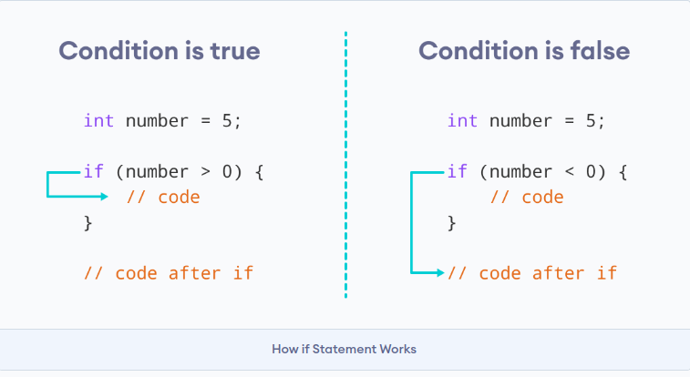

## 1️⃣ Descrizione

Un'istruzione if-else controlla il ramo condizionale. Le istruzioni nell'oggetto vengono eseguite solo se l'oggetto `if-branchcondition` restituisce un valore diverso da zero (o **`true`**). Se il valore di `condition` è diverso da zero, l'istruzione seguente viene eseguita e l'istruzione che segue viene ignorata **`else`**. In caso contrario, l'istruzione seguente viene ignorata e, se è presente un'istruzione **`else`** che segue, **`else`** viene eseguita.

## 2️⃣ Sintassi

The syntax of the `if` statement is:

LA sintassi dell' `if` statement è:

```c
if (condizione) {
  // corpo dell'if statement
}
```

L' `if` statement valuta la `condizione` dentro alle parentesi `( )`.

- Se la `condizione` risulta `true`, il codice dentro al corpo dell' `if` viene *eseguito*.
- Se la `condizione` risulta `false`, il codice dentro al corpo dell' `if` viene *evitato*.

**Nota:** Il codice dentro `{ }` è il corpo dell' `if` statement.

## 3️⃣ Funzionamento

L'istruzione **if** permette di verificare determinate condizioni ed ha la seguente sintassi:

```c
//...

if(condizione){
    //....
}

//...
```

In questo caso **se** l'espressione risulta **vera**, fa eseguire l'istruzione immediatamente successiva, **altrimenti** (se la condizione è **falsa**) si salta l'istruzione (od il blocco di istruzioni) e si procede nell'esecuzione delle istruzioni successive, che possono essere la prosecuzione del programma o un semplice **else**, ad indicare la possibile alternativa all'if:

```c
f(condizione){
    //....
} else {
    //...
}
```

o un **else if** che permette di verificare una o più condizioni:

```c
if(condizione1){
    //....
}
else if(condizione2){
    //...
} else {
    //...
}
```

Così si può comandare il flusso del programma decidendo di eseguire una parte di codice oppure no (nel caso del solo **if**), di fare una scelta tra due parti di codice (nel caso **if**– **else**) o di fare una scelta tra più parti di codice (nel caso **if** – **else if**– **else**).



## 4️⃣ In sintesi

- Utilizzare l' `if`istruzione per specificare un blocco di codice C++ da eseguire se una condizione è `true`.
- Utilizzare l' `else`istruzione per specificare un blocco di codice da eseguire se la condizione è `false`.
- Utilizzare l' `else if`istruzione per specificare una nuova condizione se la prima condizione è `false`.

*esempio*:

```c
if (risultato_esame >= 18){
    printf ("Complimenti hai superato l'esame");
}
else if (risultato_esame >= 15) {
    printf ("Devi sostenere l'orale per questo esame");
}
else {
    printf ("Non hai superato l'esame");
}
```

## 📑 Esercizi

[20 Esercizi di programmazione con la Selezione (if)](https://ticoprof.wordpress.com/2016/03/29/esercizi-di-programmazione-selezione/)

### ESERCIZIO 1

realizzare un programma che chiede all'utente 3 valori (valore1, valore2, valore3), in base ai quali il programma restituisce in output i 3 valori dal maggiore al minore.

> Esempio Output:
inserisci 3 numeri:
4
3
5
numero3 >= numero1 >= numero2
<details>
<summary>💡 Mostra soluzione</summary>

```cpp
#include <iostream>
using namespace std;

int main() {
    int numero1;
    int numero2;
    int numero3;

    cout << "inserisci 3 numeri: ";
    cin >> numero1;
    cin >> numero2;
    cin >> numero3;

if (numero1 >= numero2 && numero1 >= numero3) {
        if (numero2 >= numero3) {
            cout << "numero1 >= numero2 >= numero3" << endl;
        }
        else {
            cout << "numero1 >= numero3 >= numero2" << endl;
        }
    }
    else if (numero2 >= numero1 && numero2 >= numero3) {
        if (numero1 >= numero3) {
            cout << "numero2 >= numero1 >= numero3" << endl;
        }
        else {
            cout << "numero2 >= numero3 >= numero1" << endl;
        }
    }
    else {
        if (numero2 >= numero1) {
            cout << "numero3 >= numero2 >= numero1" << endl;
        }
        else {
            cout << "numero3 >= numero1 >= numero2" << endl;
        }
    }
        return 0;
}
```

</summary>

### ESERCIZIO 2

realizzare un programma che chiede all'utente 2 valori, in base ai quali il programma dice qual è il maggiore, oppure uguali nel caso.

> Esempio Output:
inserisci primo valore:  7
inserisci secondo valore: 3
il numero maggiore e':  7
<details>
<summary>💡 Mostra soluzione</summary>

```cpp
#include <iostream>
using namespace std;

int main(){
    int x;
    int y;

    cout << "inserisci primo valore: ";
    cin >> x;

    cout << "inserisci secondo valore: ";
    cin >> y;

    if(x>y){
        cout << "il numero maggiore e': " << x;
    }
    else if(x<y){
        cout << "il numero maggiore e': " << y;
    }
    else{
        cout << "i numeroi sono uguali";
    }
    return 0;
}
```

</summary>

### ESERCIZIO 3

realizzare un programma che chiede all'utente 1 valore, se il valore è:

$x>1 ∧ x < 5$  → il voto è estremamente insufficiente

$x>=5 ∧ x < 6$  → il voto è insufficiente

$x>=6 ∧ x < 7$  → il voto è sufficiente

$x>=7 ∧ x < 8$  → il voto è buono

$x>=8 ∧ x < 9$  → il voto è ottimo

$x>=9 ∧ x <= 10$  → il voto è eccellente

$x<0 ∨ x>10$  → il voto non è valido

> Esempio Output:
inserisci valore:  7
il voto e' buono
<details>
<summary>💡 Mostra soluzione</summary>

```cpp
#include <iostream>
using namespace std;

int main(){

    float val;

    cout << "inserisci valore: ";
    cin >> val;

    if(val1>1 && val1<5){
        cout << "il voto e' estremamente insufficiente";
    }
    else if(val1>=5 && val1<6){
        cout << "il voto e' insufficiente";
    }
    else if(val1>=6 && val1<7){
        cout << "il voto e' sufficiente";
    }
    else if(val1>=7 && val1<8){
        cout << "il voto e' buono";
    }
    else if(val1>=8 && val1<9){
        cout << "il voto e' ottimo";
    }
    else if(val1>=9 && val1<=10){
        cout << "il voto e' eccellente";
    }
    else if(val1<0 || val1>10){
        cout << "il voto non e' valido";
    }
    else {
        cout << "errore...";
    }

    return 0;

}
```

</summary>
