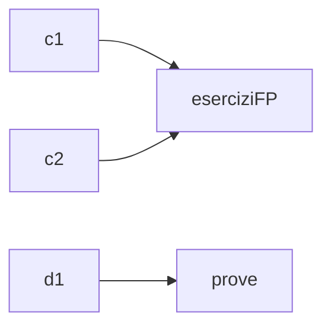

## 1. Introduzione

- Le classi correlate tra loro vengono raggruppate in **package**.
- Se la classe $c$ appartiene a un package $p$, è necessario inserire l'istruzione `package p;` all'inizio del file che contiene la classe $c$.



- Per convenzione, il nome di un package inizia con una lettera minuscola.

1. Tutti i file appartenenti allo stesso package devono essere collocati nella stessa cartella, il cui nome corrisponde a quello del package:

    ```mermaid
    flowchart TD
        src --> eserciziFP
        src --> prove
        eserciziFP --> c1.java
        eserciziFP --> c2.java
        prove --> d1.java

        style src fill:#f9c6c9,stroke:#333,stroke-width:2px,color:#0057e7
    ```

2. Se non è presente alcuna istruzione `package`, il file è considerato parte del **package di default** (generalmente la cartella `src`):

    ```mermaid
    flowchart TD
        src --> c1.java
        src --> c2.java
        src --> d1.java

        style src fill:#f9c6c9,stroke:#333,stroke-width:2px,color:#0057e7
    ```

   - **Nota**: È possibile includere una sola istruzione `package` in un file, che deve essere posta all'inizio del file, prima di qualsiasi altra istruzione.
   - È possibile riferirsi a una classe $c$ di un package $p$ da una classe in un altro package utilizzando:
       1. **Il nome completo della classe**:
           $$
           p.c
           $$

           Dove:

           - $p$ è il nome del package;
           - $c$ è il nome della classe.

           *Esempio*:

           ```java
           package prove;

           public class p1 {
               eserciziFP.c1 a;
               a = new eserciziFP.c1();
               a.f1();
               // Altre operazioni...
           }
           ```

       2. **L'istruzione `import`**, che permette di "importare" una o più classi di un package:

           *Esempio*:

           ```java
           package prove;

           import eserciziFP.c1; // Importa la classe c1

           public class d1 {
               c1 a;
               a = new c1();
               a.f1();
               // Altre operazioni...
           }
           ```

           - **Nota Bene**: `import eserciziFP.*;` importa tutte le classi del package.
           - **Nota Bene**: Classi con lo stesso nome ma in package diversi sono distinte, quindi è necessario usare il nome completo, ad esempio, *eserciziFP.c1* è diverso da *prove.c1*.

## 2. Package Standard

I package standard di Java sono sotto-package di `java`.

- **java.lang** (non richiede l'istruzione `import`)
  - Contiene classi come `Object`, `String`, `System`, `Integer`, `Character`, `Float`, ecc.
- **java.util**
  - Contiene classi come `Scanner`, `Vector`, `Set`, ecc.
- **java.io**
  - Contiene classi come `InputStream`, `PrintStream`, `IOException`, ecc.

## 3. Visibilità dei Nomi con i Package

La **visibilità** si applica sia ai **nomi delle classi** sia ai **nomi dei campi interni alle classi**.

### 3.1 Visibilità delle Classi vs Visibilità dei Campi

- **Visibilità delle classi:**
  - **public**: (esempio: `public class Razionale {…}`) La classe è visibile ovunque, anche al di fuori del package in cui è dichiarata.
  - **Default (senza `public`)**: (esempio: `class Razionale {…}`) La classe è visibile solo all'interno del package in cui è dichiarata (visibilità di package o predefinita).
- **Visibilità dei campi:**
  - **public**: I campi sono visibili ovunque.
  - **private**: I campi sono visibili solo all'interno della classe in cui sono dichiarati.
  - **Default (senza specifica)**: I campi sono visibili all'interno della classe in cui sono dichiarati e anche alle classi dello stesso package.
