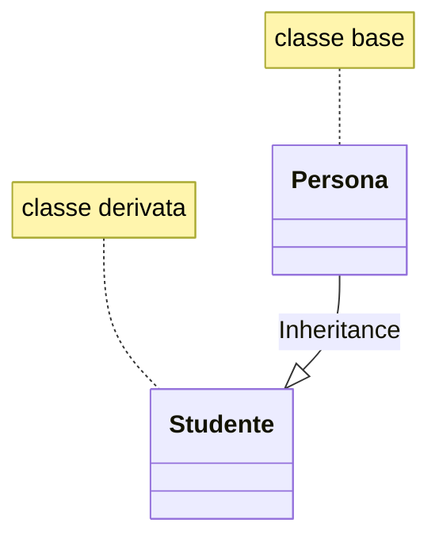
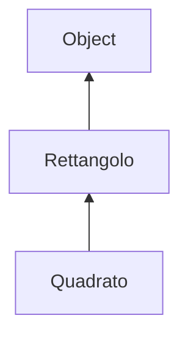
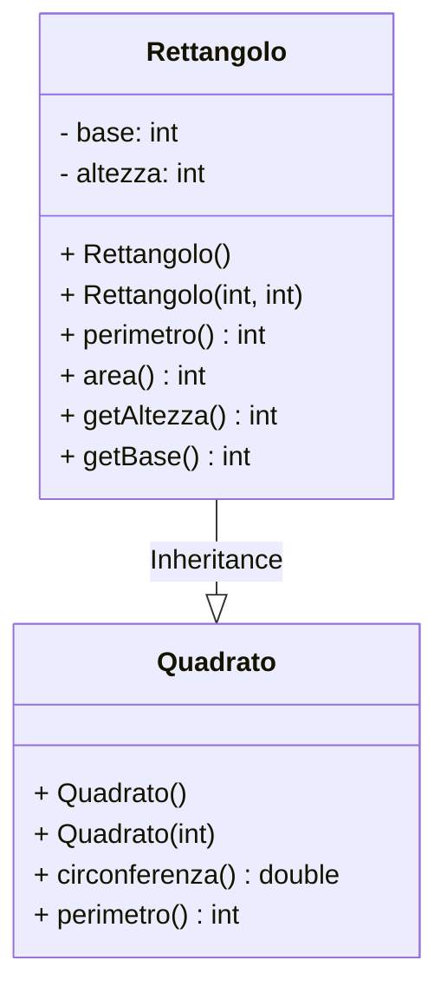

## 1. Definizione di ereditarietà

Si dice che una classe **A è una sottoclasse di B** (e analogamente che *B è una superclasse di A*) quando:

- *A* eredita da *B* sia il suo stato che il suo behavior (comportamento)
- e quindi un'istanza della classe *A* è utilizzabile in ogni parte del codice in cui sia possibile utilizzare una istanza della classe *B*.

Per esempio:



<aside>
un oggetto della classe Studente appartiene alla classe degli studenti e anche alla classe delle persone (ma non viceversa).

⇒ un oggetto Studente ha tutte le propietà (attributi e metodi) di Persona + eventuali altre sue personali propietà.
</aside>

```java
package ereditarieta;

// classe base
public class Persona {
    // attributi della classe
    private String nome;
    private String cognome;
    private String data_nascita;

    // costruttore
    // ...

    // metodi della classe
    // ...
}

// la classe Studente deriva da Persona
// => (ha accesso agli attributi e ai metodi protected e public).
public class Studente extends Persona {

    // attributi della classe
    private String matricola;

    // costruttore
    // ...

    // metodi della classe
    // ...
}
```

## 2. Visibilità

visibilità campi (dati/record) di una classe

|  | `public`  | `protected` | `(default)` | `private` |
| --- | --- | --- | --- | --- |
| nella classe in cui dichiarati | ✅ | ✅ | ✅ | ✅ |
| nello stesso package | ✅ | ✅ | ✅ | ❌ |
| nelle sottoclassi (anche se in package diversi) | ✅ | ✅ | ❌ | ❌ |
| all’esterno | ✅ | ❌ | ❌ | ❌ |

## 3. Classe Object

Tutte le classi sono derivate dalla classe Object (def. in java.lang)



---

Object contiene l'mplementazione di default di alcuni metodi, per esempio:

- `equals(Object)` → boolean
  - confronta i reference dei due oggetti (come ==).
- `toString()` → String
  - restituisce la stringa corrente al reference dell’oggetto di invocazione.
- `cone()` → Object
  - effettua una copia (superficiale) dell’oggetto di invocazione.

Questi attributi sono ereditati da tutte le classi, ma possono essere ridefinite.

## 4. Instanceof

In java è possibile determinare se un oggetto $o$ appartiene o no ad una classe $c$ con l’operatore `instanceof`

$$
o \ \ instanceof \ \ c
$$

dovre:

- $o$ → oggetto;
- $c$ → classe;

restituisce:

- true → se l’oggetto $o$ è di tipo $c$.
- false → altrimenti.

## 5. Esempio Completo



```java
package Java.ereditarieta_esempio_completo;

// classe base
public class Rettangolo {
    // attributi
    private int base;
    private int altezza;

    // costruttore senza parametri
    public Rettangolo() {
        this.base = 0;
        this.altezza = 0;
    }

    // costruttore con 2 parametri
    public Rettangolo(int base, int altezza) {
        this.base = base;
        this.altezza = altezza;
    }

    // metodo
    public int perimetro() {
        return 2*base + 2*altezza;
    }

    // metodo
    public int area() {
        return base * altezza;
    }

    // metodi getter
    public int getBase() {
        return base;
    }
    public int getAltezza() {
        return altezza;
    }
}
```

```java
package Java.ereditarieta_esempio_completo;

// classe derivata
public class Quadrato extends Rettangolo{
    // in questo caso questa classe non ha attributi
    // perchè già tutti contenuti nella classe base

    // costruttore senza parametri
    public Quadrato() {
        super();
    }

    // costruttore con un parametro
    public Quadrato(int lato){
        super(lato, lato);
    }

    // metodo
    public double circonferenza() {
        return getAltezza()*3.14;
    }

    // metodo
    public int perimetro() {
        // invoca il metodo perimetro della classe base
        return super.perimetro();
    }
}
```

```java
package Java.ereditarieta_esempio_completo;

public class Main {
    public static void main(String[] args) {
        Rettangolo r1 = new Rettangolo(5, 7);
        Quadrato q1 = new Quadrato(4);

        System.out.println(r1.area());  // area del rettangolo
        System.out.println(q1.area());  // area del quadrato

        System.out.println(r1 instanceof Rettangolo); // -> true
        System.out.println(q1 instanceof Quadrato); // -> true
        System.out.println(q1 instanceof Rettangolo); // -> true
        System.out.println(r1 instanceof Quadrato); // -> false
        System.out.println(q1 instanceof Object); // -> true
    }
}
```

## 6. Esercizi

[Ereditarietà di classi in linguaggio Java:esercizi risolti](https://www.edutecnica.it/informatica/polimorfismo_x/polimorfismo_x.htm)
