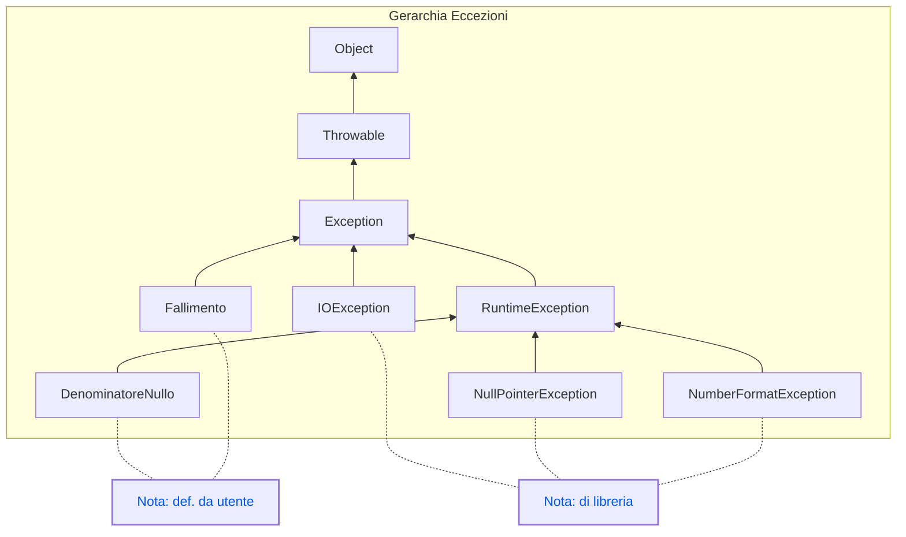

# 1️⃣ Introduzione

Le eccezioni sono un meccanismo fondamentale per la gestione degli errori in Java, fornendo un modo strutturato per gestire situazioni eccezionali che possono verificarsi durante l'esecuzione di un programma. Sebbene il concetto di eccezione sia simile a quello presente in C++, in Java le eccezioni sono trattate in modo più rigoroso e sono parte integrante del linguaggio.

### Motivazioni e meccanismi (simili a C++):

- **Generazione dell'eccezione**: In Java, un'eccezione può essere generata (o "sollevata") utilizzando la parola chiave `throw`. Questo è simile a C++, dove `throw` è utilizzato per lo stesso scopo.
- **Cattura e gestione dell'eccezione**: Per catturare e gestire un'eccezione, si utilizzano i blocchi `try-catch`. Anche questo è simile a C++, con alcune differenze sintattiche e di comportamento.

In Java, le **eccezioni sono oggetti** istanze di classi che estendono la classe base `Throwable`. Java fornisce diverse classi predefinite per gestire eccezioni comuni, ma è anche possibile definire eccezioni personalizzate.



### Tipi di eccezioni:

- **Eccezioni controllate (checked exceptions)**: Devono essere dichiarate nell’intestazione del metodo che può sollevare l’eccezione, usando la parola chiave `throws`. Il compilatore richiede che queste eccezioni siano gestite, garantendo che il programma non venga eseguito senza un'adeguata gestione degli errori. Un esempio tipico è `IOException`.
- **Eccezioni non controllate (unchecked exceptions)**: Sono eccezioni che derivano dalla classe `RuntimeException`. Non è obbligatorio dichiararle o gestirle nel codice. Esempi comuni includono `NullPointerException` e `ArithmeticException`.

# 2️⃣ Eccezioni in java

## Creazione e gestione delle eccezioni

In Java, le eccezioni sono gestite principalmente attraverso i blocchi `try-catch-finally`. Ecco la sintassi di base:

```java
try {
    // Codice che potrebbe sollevare un'eccezione
} catch (TipoEccezione e) {
    // Codice per gestire l'eccezione
} finally {
    // Codice che verrà eseguito indipendentemente dal fatto che si verifichi o 
    // meno un'eccezione
}

```

## Esempi di eccezioni

### Esempio di eccezione controllata (`IOException`)

```java
import java.io.FileReader;
import java.io.IOException;

public class EsempioIOException {
    public static void main(String[] args) {
        try {
            FileReader file = new FileReader("file.txt");
            // Operazioni sul file
        } catch (IOException e) {
            System.out.println("Errore durante l'apertura del file: " + e.getMessage());
        }
    }
}

```

In questo esempio, `IOException` è un'eccezione controllata che deve essere gestita dal programma, poiché la lettura di un file potrebbe fallire.

### Esempio di eccezione non controllata (`NullPointerException`)

```java
public class EsempioNullPointerException {
    public static void main(String[] args) {
        String testo = null;
        try {
            System.out.println(testo.length());
        } catch (NullPointerException e) {
            System.out.println("Errore: accesso a un riferimento nullo!");
        }
    }
}

```

In questo esempio, `NullPointerException` è un'eccezione non controllata che si verifica quando si tenta di accedere a un metodo o una proprietà di un oggetto che è null.

## Eccezioni personalizzate

Java consente di definire eccezioni personalizzate per rappresentare condizioni di errore specifiche della propria applicazione.

```java
class DenominatoreNulloException extends RuntimeException {
    public DenominatoreNulloException(String message) {
        super(message);
    }
}

public class EsempioEccezionePersonalizzata {
    public static void main(String[] args) {
        try {
            int risultato = divide(10, 0);
        } catch (DenominatoreNulloException e) {
            System.out.println(e.getMessage());
        }
    }

    public static int divide(int numeratore, int denominatore) {
        if (denominatore == 0) {
            throw new DenominatoreNulloException("denominatore uguale a 0!!");
        }
        return numeratore / denominatore;
    }
}

```

In questo esempio, abbiamo definito un'eccezione personalizzata `DenominatoreNulloException` per gestire il caso in cui un metodo di divisione tenti di dividere per zero.

# 📑 Esercizi

[Gestione delle eccezioni in linguaggio Java:esercizi risolti](https://www.edutecnica.it/informatica/eccezionix/eccezionix.htm)